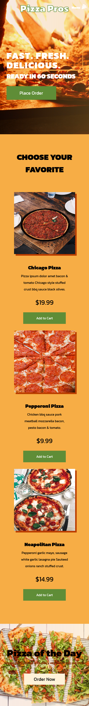
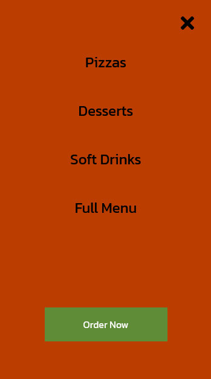

<h1>Pizza Pros :pizza:</h1>

<h2>A pizza website created using React using styled components. </h2>

This website is responsive using flexbox, grid, and CSS custom properties. I created this following the tutorial of Brian Design. I updated the images, text, added another section for soft drinks, and added a video along with changing the the color scheme of the website. Screenshots of what the website looks like desktop and mobile along with the sidebar in mobile.

### Link

- Live Site: [Pizza Pros Website]()

### Screenshots

